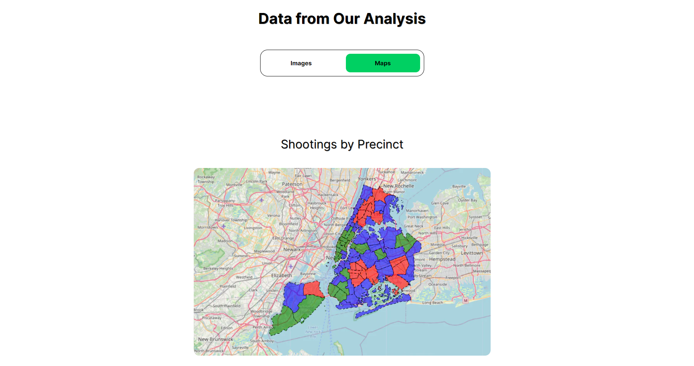

<div align="center">
  
</div>

<br>
<p align="center">
<b>Team XYZ presents Bullets Over Broadway
<br>
</p>
<blockquote align="center"> 
  built on <span style="color: #8b0000;">☕</span> for <a href="https://youth-data-hack.devpost.com/">Youth Data Hack</a>.

</blockquote>

# 💡 Problem Statement

Analyze a public dataset to gain insights into a social, environmental, or economic issue and develop a data driven solution.

# 🧠 Knowledge Primer

### Dataset
The analysis is based on the NYPD Shooting Incident Data (Historic) dataset. The data is loaded into a Pandas DataFrame, revealing insights into various aspects of shooting incidents.

### Exploratory Data Analysis (EDA)
The EDA includes the use of Python libraries such as Pandas, Matplotlib, Seaborn and Folium for visualization and geospatial analysis.

### Key Visualizations
1. **Shootings by Borough:**
   - Bar chart illustrating the number of shootings in each borough.

2. **Shootings Over Time:**
   - Line chart depicting the trend of shootings over time on a monthly basis.

3. **Perpetrator Age Group Distribution:**
   - Bar chart showing the distribution of shootings based on perpetrator age groups.

4. **Perpetrator Gender and Race Distribution:**
   - Stacked bar charts illustrating the distribution of shootings based on perpetrator gender and race.

5. **Victim Age, Gender and Race Distributions:**
   - Stacked bar charts showing the distribution of shootings based on victim age, gender and race.

6. **Shootings Resulting in Murder:**
   - Pie chart indicating the proportion of shootings resulting in murder.

7. **Geospatial Analysis:**
   - Folium map with a heatmap indicating the locations of shooting incidents.

8. **Cross-tabulations:**
   - Tables showing relationships between variables such as perpetrator race vs. victim race, perpetrator age group vs. victim age group and perpetrator gender vs. victim gender.

9. **Additional Analysis:**
   - Various charts analyzing shootings by time of day, day of the week and top precincts.

### Clustering Analysis
The knowledge primer concludes with a clustering analysis using K-Means clustering. The analysis explores patterns based on precinct, location, time of day and day of the week.

# 📺 Preview

<div align="center">
  
</div>
<div align="center">
  
</div>
<div align="center">
  
</div>
<div align="center">
  
</div>
<div align="center">
  
</div>


# 💻 Tech Stack / Libraries

- Next.js
- JavaScript
- Leaflet
- Jupyter Notebook
- Pandas
- Matplotlib
- Seaborn
- Folium
- Scikit-learn (sklearn)
- NumPy

# 📜 License

`Bullets Over Broadway` is available under the MIT license. See the [`LICENSE`](https://github.com/HackRx3/PS1_NudgeFudge/blob/main/LICENSE) file for more info.

# 💥 Contributors

<a href="https://github.com/GyaneshSamanta/Youth-Data-Hack/graphs/contributors">

</a>

</a>
                                                                                  
# 🚨 Forking this repo

This is a [Next.js](https://nextjs.org/) project bootstrapped with [`create-next-app`](https://github.com/vercel/next.js/tree/canary/packages/create-next-app).

## Getting Started

First, run the development server:

```bash
yarn dev
# or
npm run dev
# or
pnpm dev
```

Open [http://localhost:3000](http://localhost:3000) with your browser to see the result.

You can start editing the page by modifying `app/page.js`. The page auto-updates as you edit the file.

This project uses [`next/font`](https://nextjs.org/docs/basic-features/font-optimization) to automatically optimize and load Inter, a custom Google Font.

# Conclusion
The provided Python code and visualizations offer a comprehensive understanding of the NYPD shooting incident data, providing valuable insights for addressing our problem statement for the Youth Data Hack event.